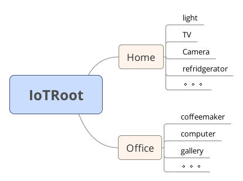
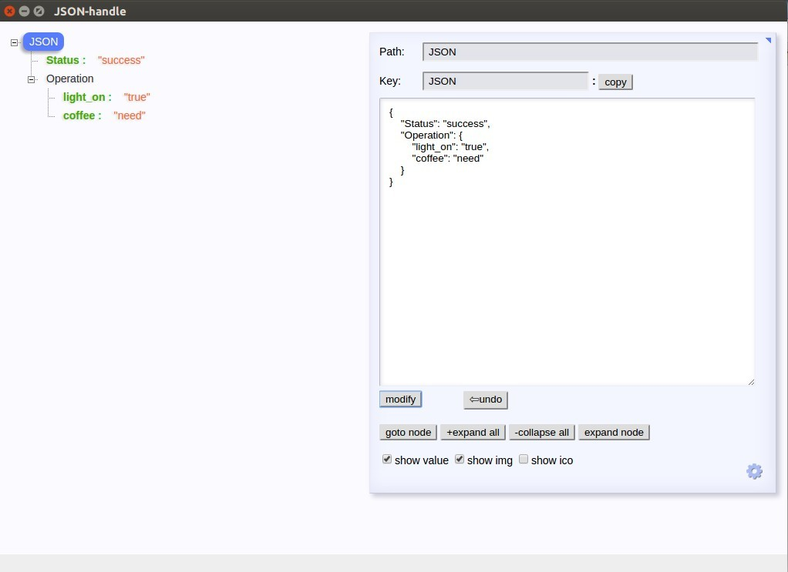

# 通信协议
  我在这里的思考是,我们如果去做智能家居的产品,如何将家中的各个家用电气连接到一起?首先我们假定,所有家用电器已经有了电气连接, 
那么如何将其接入家庭中控台(这里我先用树莓派来实现家庭中控台功能)?而且你有很小数据量的传输,比如简单命令控制灯泡亮度, 
也有大数据量的传输,比如监控视频流的传输(这个功能可能不使用MQTT协议),思考的问题就变得复杂了很多.所以在这个位置我们来看一下通信协议的问题,并且做出制定!

## 从MQTT开始
  上一篇我们讲解了MQTT的主题分级问题,以此为基础,先制定简单的层级通信协议,然后我们针对具体内容再来讲解.

### 主题层级
  既然我们是做物联网的开发,这样我们把最高层级的主题名称定为**IoTRoot**.考虑到我们可能在多个位置,比如家,办公室都有 
设备,那么第二个层级就设定为**Home**和**Office**两个主题.第三个层级就是具体到我们需要连接的设备,比如我们的灯泡,电饭煲等等, 
第三个层级我们就用具体的名称来表示,例如**light**,**TV**, **Camera**等等.这样我们的主题层级设定完毕.
  用一张图来解释的话就是这样:

  

### 具体内容
  主题有了，我们还需要具体的通信内容支持．也就是我们的消息中携带的Message.Message的制定我这里采用Json格式来传输,相比xml更加简单. 
首先确定一个状态的Key,名称为*Status*;然后确定一个操作的Key,称为*Operation*,在Operation对象下有多个设备操作的Key-value值, 
例如light_on,light_off类似这样的操作.具体的格式我们也是用一张图片来描述:

  

### 服务质量等级（Qos）
  首先我们需要思考的是，哪种对电器的操作需要很高的服务质量等级？看上去目前都不需要太高的服务质量等级，这个后续再探讨吧！
