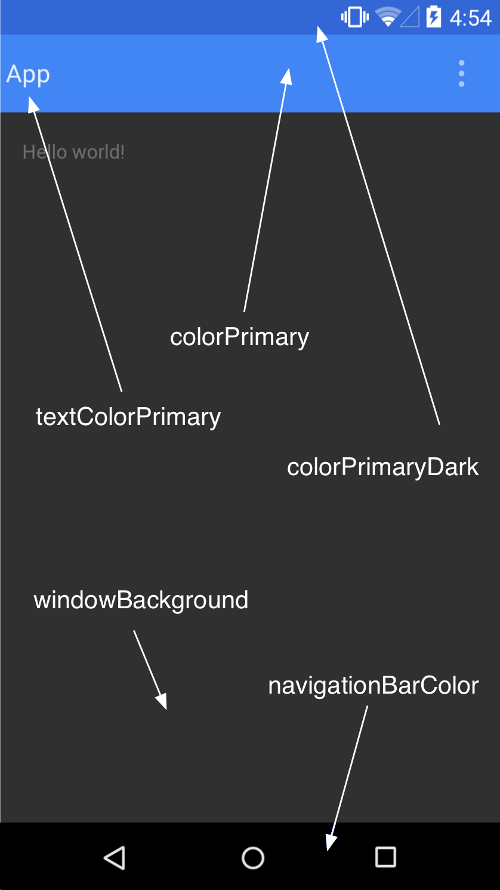

# Android客户端的开发
  这个章节进入android客户端的开发,android客户端作为客户端开发的开篇,有必要在开篇规划应用程序的内容.

## 开发任务
  * 实现基本的数据获取和发送,也就是类似paho-Android官方客户端那样的功能,但是没必要那么完善,先实现基本功能.
  * 针对多个传感器内容设置一个完整桌面小部件,可以直接在桌面上显示各项传感器参数.
  * 界面设计使用Material Design,实现Material Design Android上的基本组件使用,主要是Support Library的应用.
  * 开源组件的使用,用到后在这里添加!

## 代码同步
  所有代码将放在[github](https://github.com/JamesLiAndroid/IOT-Paho-Android-Demo)中,而且我会把开发到某个阶段的代码统一打上tag,方便区分!

## 基本开发工程的建立
  这里我们需要实现的是构建一个Material Design的基本工程,实现Material Design设计的基本组件,作为开发的雏形. 
  下面的文章翻译自[Material Design with the Android Design Support Library](http://www.sitepoint.com/material-design-android-design-support-library/),内容可能有出入,也会有我自己添加的东西.我大体翻译一下:

  Material Design是一种全新的设计语言,不仅应用在Android app开发,也可以用在其他平台的app开发上.它从Android5.0引入. 
  最大的特点是引入了新的UI开发组件,比如"Floating Action Bar".当使用这些新的组件的时候,需要考虑向后兼容的问题,这又是一个冗长而乏味的工作过程.第三方库的引入通常可以简化开发! 
  在去年的google开发者大会上,google带来了全新的Android Design Support Library,包含了很多重要的Material Design组件.这些组件可以向后兼容到Android 2.1版本,并且比起以前更容易实现.这个Support
  Library包含了抽屉布局(navigation drawer view),带浮动标志的EditText,FAB(floating action button),snackbar,tab以及一个为他们设计的处理动作(motion)和滚动的框架.在这个教程中我们将展示这些组件如何进行使用! 
### 开始
  在开始应用这些组件之前,我们将创建一个工程,并且设计一个风格,使用Android Studio来创建一个工程,把它命名为"IOT-Android",其他的设置都选择默认设置即可,但是要注意的是最低SDK版本(Minimum SDK)版本必须是API 15,即Android4.0. 
  需要将下面的依赖库添加到build.gradle(Module:app)文件中:
  > compile 'com.android.support:appcompat-v7:23.1.1'
    compile 'com.android.support:design:23.1.1'
    compile 'com.android.support:cardview-v7:23.1.1'

  PS: 这个版本中,RecyclerView不需要自己再添加,只需要添加CardView即可,CardView我们将在后续使用到!然后同步一下工程(Sync),同步的过程中会下载相应的支持库!
  在*res/values*文件夹下,找到*color.xml*,如果没有的话就创建一个,修改如下:

    <?xml version="1.0" encoding="utf-8"?>
    <resources>
      <color name="primary">#3F51B5</color>
      <color name="primary_dark">#303F9F</color>
      <color name="accent">#FF4081</color>
    </resources>
  继续,我们将*res/values/strings.xml*进行编写,这个文件中的字符串资源是我们在程序中用到的所有资源.

    <resources>
      <string name="app_name">Design Demo</string>
      <string name="hello_world">Hello world!</string>
      <string name="action_settings">Settings</string>
      <string name="nav_item_attachment">Attachment</string>
      <string name="nav_item_images">Images</string>
      <string name="nav_item_location">My Location</string>
      <string name="nav_sub_menu">Sub Menu</string>
      <string name="nav_sub_menu_item01">Sub Menu Item 1</string>
      <string name="nav_sub_menu_item02">Sub Menu Item 2</string>
      <string name="drawer_header_text">Drawer Header</string>
      <string name="second_activity_text">Lorem ipsum dolor sit amet, consectetur adipiscing elit. Proin consectetur diam id aliquam scelerisque. Donec ultrices lacus vel dignissim pharetra. Vivamus pharetra augue quis rhoncus placerat. Sed ultricies at risus non cursus. Nam rutrum leo nec placerat consectetur. Vestibulum feugiat eleifend diam, nec interdum augue tincidunt sit amet. Praesent feugiat est auctor lacus consectetur, vitae pellentesque dolor laoreet.</string>
      <string name="title_activity_second">SecondActivity</string>
    </resources>
  将*res/values/styles.xml*进行编写,如下:

    <resources>
    <!-- Base application theme. -->
    
    </resources>
  在上述的代码中,我们定制了app的[ColorPlatte](https://developer.android.com/training/material/theme.html#ColorPalette),在Material Design的指导下设置了primary,primary-dark,以及accent color三种颜色.其他颜色的设置可以参考下图所显示的内容设置:

  

  这里需要注意的是我们并没有在*name*属性中包含*android*:(例如android:colorPrimaryDark),这个是向后兼容的考虑.包含*android*:的话必须将最低的SDK版本(Minimum SDK)设置为21.我们使用*NoActionBar*的主题,是因为我们要用Toolbar来代替ActionBar.创建Toobar,在*res/layout/activity_main*中编写,如下:

    <RelativeLayout xmlns:android="http://schemas.android.com/apk/res/android"
      xmlns:tools="http://schemas.android.com/tools"
      android:layout_width="match_parent"
      android:layout_heigh
      t="match_parent"
      tools:context=".MainActivity">

      <android.support.v7.widget.Toolbar
        android:id="@+id/toolbar"
        android:layout_width="match_parent"
        android:layout_height="?attr/actionBarSize"
        android:background="?attr/colorPrimary"
        android:theme="@style/ThemeOverlay.AppCompat.Dark" />

      </RelativeLayout>

  以上我们移除了RelativeLayout中默认的padding属性,并且从支持库添加Toolbar.如果你支持的设备从API21开始甚至更高版本,可以直接使用默认的Toolbar而不是使用兼容库中的!
  在*MainActivity.java*中,对*onCreate(Bundle)*方法进行编写,如下:

    @Override
    protected void onCreate(Bundle savedInstanceState) {
        super.onCreate(savedInstanceState);
        setContentView(R.layout.activity_main);

        Toolbar toolbar = (Toolbar) findViewById(R.id.toolbar);
        setSupportActionBar(toolbar);
        ActionBar actionBar = getSupportActionBar();
        actionBar.setHomeAsUpIndicator(R.drawable.ic_menu);
        actionBar.setDisplayHomeAsUpEnabled(true);
    }     

  从Github下载项目中资源文件到本地,包含你所需要的*drawable*文件夹,你可以把它们粘贴到* res*文件夹下,那么你的代码也就不会报错了! 
  当Android Studio出现提示的时候,请确定你是从support library中导入的Toolbar. 
  在上面的代码中,我们得到了Toolbar的引用,并且将它设置为ActionBar,然后得到ActionBar的引用,并且将它设置为Home icon.运行名称为app的Module,你会看到Toolbar取代ActionBar的效果如下:

  

### 抽屉布局(NavigationView)
  抽屉布局是Android app开发中常用的组件,是一种构建Android应用导航的方式,另一种是Tab和Spinner.自己来实现从来不是一个简洁的方式,但是有了Design Support Library,一切变得简单了不少, 在*activity_main.xml*中加入代码如下:

    <android.support.v4.widget.DrawerLayout
      xmlns:android="http://schemas.android.com/apk/res/android"
      xmlns:app="http://schemas.android.com/apk/res-auto"
      android:id="@+id/drawer_layout"
      android:layout_width="match_parent"
      android:layout_height="match_parent"
      android:fitsSystemWindows="true">

      <RelativeLayout
          android:layout_width="match_parent"
          android:layout_height="match_parent">

          <android.support.v7.widget.Toolbar
              android:id="@+id/toolbar"
              android:layout_width="match_parent"
              android:layout_height="?attr/actionBarSize"
              android:background="?attr/colorPrimary"
              android:theme="@style/ThemeOverlay.AppCompat.Dark" />

        </RelativeLayout>

      <android.support.design.widget.NavigationView
        android:id="@+id/navigation_view"
        android:layout_width="wrap_content"
        android:layout_height="match_parent"
        android:layout_gravity="start"
        app:headerLayout="@layout/drawer_header"
        app:menu="@menu/drawer"/>
    </android.support.v4.widget.DrawerLayout>

  在上面的代码中,我们向布局中添加了NavigationView,NavigationView放置在DrawerLayout中.两个很重要的属性需要注意一下,一个是*app:headerLayout*确定NavigationView中是否使用Header; *app:menu*确定menu资源是否会被渲染到Navigation条目中(可以在运行过程中更新).

  在*res/layout*目录下创建一个*drawer_layout.xml*文件,编写代码如下:

    <?xml version="1.0" encoding="utf-8"?>
    <LinearLayout xmlns:android="http://schemas.android.com/apk/res/android"
      android:orientation="vertical"
      android:layout_width="match_parent"
      android:layout_height="150dp"
      android:background="?attr/colorPrimaryDark"
      android:padding="16dp"
      android:theme="@style/ThemeOverlay.AppCompat.Dark"
      android:gravity="bottom">

      <TextView
          android:layout_width="match_parent"
          android:layout_height="wrap_content"
          android:text="@string/drawer_header_text"
          android:textAppearance="@style/TextAppearance.AppCompat.Body1"/>

      </LinearLayout>

  这里创建了一个drawer的头部布局,头部布局中使用了app中设置的primary color,有着150dp的高度以及一段文字.
  随后我们需要在*res/menu*中创建*drawer.xml*,代码如下:

    <?xml version="1.0" encoding="utf-8"?>
    <menu xmlns:android="http://schemas.android.com/apk/res/android">

    <group android:checkableBehavior="single">
        <item
            android:id="@+id/navigation_item_attachment"
            android:checked="true"
            android:icon="@drawable/ic_attachment"
            android:title="@string/nav_item_attachment" />
        <item
            android:id="@+id/navigation_item_images"
            android:icon="@drawable/ic_image"
            android:title="@string/nav_item_images" />
        <item
            android:id="@+id/navigation_item_location"
            android:icon="@drawable/ic_place"
            android:title="@string/nav_item_location" />
      </group>

      <item android:title="@string/nav_sub_menu">
        <menu>
          <item
              android:icon="@drawable/ic_emoticon"
              android:title="@string/nav_sub_menu_item01" />
          <item
              android:icon="@drawable/ic_emoticon"
              android:title="@string/nav_sub_menu_item02" />
          </menu>
      </item>

    </menu>

  在上述代码中,我们创建了抽屉的菜单条目,第一个部分是可选的menu条目,选中的条目将会在Navigation Drawer中高亮显示,使用户明白哪个条目当前已经被选中了.第二部分我们使用了子Header来区分同第一部分条目的关系! 
  在*MainActivity.java*中,添加下面的变量:

    private DrawerLayout mDrawerLayout;

  然后在*onCreate(Bundle)*方法底部添加如下代码:

    mDrawerLayout = (DrawerLayout) findViewById(R.id.drawer_layout);

  随后编写*onOptionsItemSelected(MenuItem)*如下所示:

    @Override
    public boolean onOptionsItemSelected(MenuItem item) {
      // Handle action bar item clicks here. The action bar will
      // automatically handle clicks on the Home/Up button, so long
      // as you specify a parent activity in AndroidManifest.xml.
      int id = item.getItemId();

      switch (id) {
        case android.R.id.home:
            mDrawerLayout.openDrawer(GravityCompat.START);
            return true;
        case R.id.action_settings:
            return true;
      }

      return super.onOptionsItemSelected(item);
    }

  这时你就可以通过屏幕上的Home Button(也就是那个像汉堡一样的menu标签),点击即可唤出drawer,向右滑动同样可以!运行app你将看到下面的情形:

  

  对Menu Item捕获点击事件,我们需要对NavigationView设置OnNavigationItemSelectedListener.将下面的代码放在*onCreate(Bundle)*的最后,如下:

    NavigationView navigationView = (NavigationView) findViewById(R.id.navigation_view);
    navigationView.setNavigationItemSelectedListener(new NavigationView.OnNavigationItemSelectedListener() {
        @Override
        public boolean onNavigationItemSelected(MenuItem menuItem) {
            menuItem.setChecked(true);
            mDrawerLayout.closeDrawers();
            Toast.makeText(MainActivity.this, menuItem.getTitle(), Toast.LENGTH_LONG).show();
            return true;
          }
      });

  上面的代码为navigation view设置了监听器,当drawer menu中条目被选中的时候,menu item就被设置为选中了(仅仅作用于被选中的条目),抽屉将会关闭并弹出Toast,显示选中的menu条目名称.

  在真正的开发过程中,你更喜欢选中item后定向到某个Fragment而不是仅仅显示一个Toast.如果你再次打开drawer,你可以确定你选中的条目已经被设置为高亮(仅仅作用于你选中的条目)!

### Floating Action Bar(FAB)
  FAB是一个在你的交互界面上指示一些基本操作圆形按钮,Support Library中通过FloatingActionBar给出了一个拥有一致体验的实现,默认的颜色是我们在主题中声明的*colorAccent*,而且默认的normal型号大小是56dp,它还支持mini型号(44dp),使得可以选择用在有着更加严格要求的场合. 
  要在布局中添加FAB,我们在*res/layout/activity_main.xml*中编写代码为:

    <android.support.v4.widget.DrawerLayout
      xmlns:android="http://schemas.android.com/apk/res/android"
      xmlns:app="http://schemas.android.com/apk/res-auto"
      android:id="@+id/drawer_layout"
      android:layout_width="match_parent"
      android:layout_height="match_parent"
      android:fitsSystemWindows="true">

      <RelativeLayout
          android:layout_width="match_parent"
          android:layout_height="match_parent">

          <android.support.v7.widget.Toolbar
              android:id="@+id/toolbar"
              android:layout_width="match_parent"
              android:layout_height="?attr/actionBarSize"
              android:background="?attr/colorPrimary"
              android:theme="@style/ThemeOverlay.AppCompat.Dark" />

          <android.support.design.widget.FloatingActionButton
            android:id="@+id/fab"
            android:layout_width="wrap_content"
            android:layout_height="wrap_content"
            android:layout_alignParentBottom="true"
            android:layout_alignParentRight="true"
            android:layout_marginRight="@dimen/activity_horizontal_margin"
            android:layout_marginBottom="@dimen/activity_vertical_margin"
            android:src="@drawable/ic_done" />

        </RelativeLayout>

      <android.support.design.widget.NavigationView
        android:id="@+id/navigation_view"
        android:layout_width="wrap_content"
        android:layout_height="match_parent"
        android:layout_gravity="start"
        app:headerLayout="@layout/drawer_header"
        app:menu="@menu/drawer"/>
    </android.support.v4.widget.DrawerLayout>

  在上面的代码中,我们把FAB添加在了布局文件中右下角的位置,*android:src*为FAB指定了显示的图片.在代码中你也可以使用*setImageDrawable()*来指定.执行代码后你可以看到FAB的效果:

  

  在下个章节,我们将为FAB添加点击事件!

### SnackBar
  传统的方式下,如果你需要向用户传达简短的反馈,你可以使用Toast.现在我们有了另一个选项--SnackBar. 
  SnackBar会显示在屏幕的下方,而且包含文字以及一个简短的操作,它会自动在一定时间以后通过动画自动消失.用户也可以通过猛烈点击的方式使它在超时前消失. 
  通过在SnackBar中添加交互和猛击消失,SnackBar比Toast的功能更加强大,而且API调用上也是十分简单的!

  在*MainActivity.java*中,在*onCreate(Bundle)*方法最后添加如下代码:

    FloatingActionButton fab = (FloatingActionButton)findViewById(R.id.fab);
    fab.setOnClickListener(new View.OnClickListener() {
      @Override
      public void onClick(View v) {
      Snackbar.make(findViewById(R.id.drawer_layout), "I'm a Snackbar", Snackbar.LENGTH_LONG).setAction("Action", new View.OnClickListener() {
              @Override
              public void onClick(View v) {
                  Toast.makeText(MainActivity.this, "Snackbar Action", Toast.LENGTH_LONG).show();
              }
          }).show();
        }
      });

  在上述代码中,我们为FAB设置了点击事件,所以当它被点击的时候,SnackBar将会显示.我们也为SnackBar上设置了点击事件的监听,当SnackBar上的按钮被点击时,将会显示Toast.

  注意*make()*方法的第一个参数,必须是View类型的,而且必须是整个布局中最外层的View.SnackBar将会为自己尝试去寻找一个合适的父类来确定SnackBar确实是被固定在底部的.运行这个app,将会看到以下画面:

  

  注意这时候SnackBar是和FAB重合的,我们将会在CoordinatorLayout章节中修复这个问题!

### TabLayout
  使用Tab来在不同view中进行切换在Android上来说并不是一个新的概念.Design Support Library中提供了TabLayout来简化在app中添加tab的操作.它不止实现了固定的tab,为每个tab分配了等间距的区分;而且也实现了可以卷动的tab,有着统一的大小并且可以水平距离上滑动. 
  在app中添加tab,我们在*res/layout/activity_main.xml*实现如下代码:

    <android.support.v4.widget.DrawerLayout
      android:id="@+id/drawer_layout"
      xmlns:android="http://schemas.android.com/apk/res/android"
      xmlns:app="http://schemas.android.com/apk/res-auto"
      android:layout_width="match_parent"
      android:layout_height="match_parent"
      android:fitsSystemWindows="true">

      <RelativeLayout
          android:layout_width="match_parent"
          android:layout_height="match_parent">

          <LinearLayout
              android:layout_width="match_parent"
              android:layout_height="match_parent"
              android:orientation="vertical">

            <android.support.v7.widget.Toolbar
                android:id="@+id/toolbar"
                android:layout_width="match_parent"
                android:layout_height="?attr/actionBarSize"
                android:background="?attr/colorPrimary"
                android:theme="@style/ThemeOverlay.AppCompat.Dark" />

            <android.support.design.widget.TabLayout
                android:id="@+id/tablayout"
                android:layout_width="match_parent"
                android:layout_height="wrap_content"
                android:background="?attr/colorPrimary"
                app:tabGravity="fill"
                android:theme="@style/ThemeOverlay.AppCompat.Dark" />

            <android.support.v4.view.ViewPager
                android:id="@+id/viewpager"
                android:layout_width="match_parent"
                android:layout_height="0dp"
                android:layout_weight="1"/>

          </LinearLayout>

          <android.support.design.widget.FloatingActionButton
              android:id="@+id/fab"
              android:layout_width="wrap_content"
              android:layout_height="wrap_content"
              android:layout_alignParentBottom="true"
              android:layout_alignParentRight="true"
              android:layout_marginBottom="@dimen/activity_vertical_margin"
              android:layout_marginRight="@dimen/activity_horizontal_margin"
              android:src="@drawable/ic_done"/>

      </RelativeLayout>

      <android.support.design.widget.NavigationView
          android:id="@+id/navigation_view"
          android:layout_width="wrap_content"
          android:layout_height="match_parent"
          android:layout_gravity="start"
          app:headerLayout="@layout/drawer_header"
          app:menu="@menu/drawer"/>
    </android.support.v4.widget.DrawerLayout>

  在布局文件中我们添加了TabLayout和ViewPager.ViewPager将会被用于在tab之间水平切换页面!

  在MainActivity.java中,我们添加下面的代码作为其中的子类:

    public static class DesignDemoFragment extends Fragment {
        private static final String TAB_POSITION = "tab_position";

        public DesignDemoFragment() {

        }

        public static DesignDemoFragment newInstance(int tabPosition) {
            DesignDemoFragment fragment = new DesignDemoFragment();
            Bundle args = new Bundle();
            args.putInt(TAB_POSITION, tabPosition);
            fragment.setArguments(args);
            return fragment;
        }

        @Nullable
        @Override
        public View onCreateView(LayoutInflater inflater, ViewGroup container, Bundle savedInstanceState) {
            Bundle args = getArguments();
            int tabPosition = args.getInt(TAB_POSITION);
            TextView tv = new TextView(getActivity());
            tv.setGravity(Gravity.CENTER);
            tv.setText("Text in Tab #" + tabPosition);
            return tv;
        }
      }

      static class DesignDemoPagerAdapter extends FragmentStatePagerAdapter {

      public DesignDemoPagerAdapter(FragmentManager fm) {
          super(fm);
      }

      @Override
      public Fragment getItem(int position) {
          return DesignDemoFragment.newInstance(position);
      }

      @Override
      public int getCount() {
          return 3;
      }

      @Override
      public CharSequence getPageTitle(int position) {
        return "Tab " + position;
      }
    }

  这里主要添加了两个子类,我们还需要把剩下的代码添加到*onCreate(Bundle)*最后:

    DesignDemoPagerAdapter adapter = new DesignDemoPagerAdapter(getSupportFragmentManager());
    ViewPager viewPager = (ViewPager)findViewById(R.id.viewpager);
    viewPager.setAdapter(adapter);
    TabLayout tabLayout = (TabLayout)findViewById(R.id.tablayout);
    tabLayout.setupWithViewPager(viewPager);

  上面的代码中我们创建了Fragment的子类,一个简单的Fragment,里面只有一个简单的TextView.我们随后创建了FragmentStatePagerAdapter作为ViewPager的适配器.在DesignDemoPagerAdapter中的*getCount()*方法返回的是tab或者page的页数,*getItem(int)*方法返回的是让哪一个Fragment放在前台显示,*getPageTitle(int)*返回的是在特定tab上显示的title.让上述的方法起作用,我们在TabLayout上使用setupWithViewPager(ViewPager)方法.这个方法确定了tab选择操作作用在ViewPager上的时候可以及时更新并且跳转到选择的Fragment页面.

  运行app Module即可看到tab的效果,如下图所示:

  

### CoordinatorLayout
  Design Support Library引入了CoordinatorLayout,它提供了一种额外的层级来控制子view之间的触摸操作,这种方式也是Design Support Library中很多组件所采用的!

  一个例子就是当你将FloatingActionButton作为子view添加到CoordinatorLayout中时,也会把对Snackbar.make()的调用传给CoordinatorLayout.

  为了避免像之前看到的SnackBar显示在FAB上,FAB需要使用由CoordinatorLayout提供的额外的回调机制来是它适应当SnackBar向上弹出的时候FAB也会进行相应的调整,并且当SnackBar移出屏幕的时候,FAB会返回到它的位置上!这个机制最低支持到Android3.0版本!

  为了使用CoordinatorLayout,我们需要在*res/layout/activity_main.xml*中进行操作:

    <android.support.v4.widget.DrawerLayout
      android:id="@+id/drawer_layout"
      xmlns:android="http://schemas.android.com/apk/res/android"
      xmlns:app="http://schemas.android.com/apk/res-auto"
      android:layout_width="match_parent"
      android:layout_height="match_parent"
      android:fitsSystemWindows="true">

      <android.support.design.widget.CoordinatorLayout
          android:id="@+id/coordinator"
          android:layout_width="match_parent"
          android:layout_height="match_parent">

          <LinearLayout
              android:layout_width="match_parent"
              android:layout_height="match_parent"
              android:orientation="vertical">

              <android.support.v7.widget.Toolbar
                  android:id="@+id/toolbar"
                  android:layout_width="match_parent"
                  android:layout_height="?attr/actionBarSize"
                  android:background="?attr/colorPrimary"
                  android:theme="@style/ThemeOverlay.AppCompat.Dark" />

              <android.support.design.widget.TabLayout
                  android:id="@+id/tablayout"
                  android:layout_width="match_parent"
                  android:layout_height="wrap_content"
                  android:background="?attr/colorPrimary"
                  app:tabGravity="fill"
                  android:theme="@style/ThemeOverlay.AppCompat.Dark" />

              <android.support.v4.view.ViewPager
                  android:id="@+id/viewpager"
                  android:layout_width="match_parent"
                  android:layout_height="0dp"
                  android:layout_weight="1"/>

            </LinearLayout>

          <android.support.design.widget.FloatingActionButton
              android:id="@+id/fab"
              android:layout_width="wrap_content"
              android:layout_height="wrap_content"
              android:layout_alignParentBottom="true"
              android:layout_gravity="bottom|right"
              android:layout_marginBottom="@dimen/activity_vertical_margin"
              android:layout_marginRight="@dimen/activity_horizontal_margin"
              android:src="@drawable/ic_done"/>

        </android.support.design.widget.CoordinatorLayout>

      <android.support.design.widget.NavigationView
          android:id="@+id/navigation_view"
          android:layout_width="wrap_content"
          android:layout_height="match_parent"
          android:layout_gravity="start"
          app:headerLayout="@layout/drawer_header"
          app:menu="@menu/drawer"/>
    </android.support.v4.widget.DrawerLayout>

  上面的代码展示了,FAB需要作为CoordinatorLayout中的子控件,所以我需要用CoordinatorLayout替换此前使用的RelativeLayout,并且需要注意的是FAB的位置设置变成了:
>  android:layout_gravity="bottom|right".
  然后我们需要在MainActivity.java中在构建SnackBar的过程中传入CoordinatorLayout作为参数,像下面这样:

    //                         注意这个位置R.id.coordinator
    Snackbar.make(findViewById(R.id.coordinator), "I'm a Snackbar", Snackbar.LENGTH_LONG).setAction("Action", new View.OnClickListener() {
              @Override
              public void onClick(View v) {
                  Toast.makeText(MainActivity.this, "Snackbar Action", Toast.LENGTH_LONG).show();
              }
          }).show();

  我们运行这个项目,现在我们来点击FAB,这个SnackBar滑动进入View中,但是这次并没有与FAB发生重叠,正如下图所示的那样.当因为超时或者猛击(swipe)的时候从View中消失,FAB将会回到原来的位置!

  

  另一种CoordinatorLayout主要的用途是有关app bar和滚动技术.Design Support Library提供了AppBarLayout来允许Toolbar和其他视图(被ScrollingViewBehavior标记的,例如TabLayout提供的tabs)来对滚动事件作出反应.

  在看讨论上述问题之前,我们先创建个我们可以滚动的组件,我们将使用RecyclerView来创建一个可以滚动的列表!

  我们需要在*build.gradle*(Module:app)中的dependencies节点下添加如下代码并同步(sync)一下gradle文件:

    compile 'com.android.support:recyclerview-v7:23.1.1'

  然后我们需要在*res/layout*文件夹下,创建*fragment_list_view.xml*,代码如下:

    <?xml version="1.0" encoding="utf-8"?>
    <android.support.v7.widget.RecyclerView
      xmlns:android="http://schemas.android.com/apk/res/android"
      android:id="@+id/recyclerview"
      android:layout_width="match_parent"
      android:layout_height="match_parent"/>

  同时创建另外一个布局文件*list_row.xml*,用下面的代码替换里面的内容:

    <?xml version="1.0" encoding="utf-8"?>
    <LinearLayout xmlns:android="http://schemas.android.com/apk/res/android"
        android:orientation="vertical"
        android:padding="16dp"
        android:layout_width="match_parent"
        android:layout_height="56dp">

    <TextView
        android:id="@+id/list_item"
        android:layout_width="wrap_content"
        android:layout_height="wrap_content"/>

    </LinearLayout>

  创建*DesignDemoRecyclerAdapter.java*文件,内容如下:

    package com.echessa.designdemo; // Rename as Appropriate

    import android.support.v7.widget.RecyclerView;
    import android.view.LayoutInflater;
    import android.view.View;
    import android.view.ViewGroup;
    import android.widget.TextView;

    import java.util.List;

    /**
    * Created by echessa on 7/24/15.
    */
    public class DesignDemoRecyclerAdapter extends RecyclerView.Adapter<DesignDemoRecyclerAdapter.ViewHolder> {

        private List<String> mItems;

        DesignDemoRecyclerAdapter(List<String> items) {
            mItems = items;
        }

        @Override
        public ViewHolder onCreateViewHolder(ViewGroup viewGroup, int i) {
            View v = LayoutInflater.from(viewGroup.getContext()).inflate(R.layout.list_row, viewGroup, false);

            return new ViewHolder(v);
          }

        @Override
        public void onBindViewHolder(ViewHolder viewHolder, int i) {
            String item = mItems.get(i);
            viewHolder.mTextView.setText(item);
        }

        @Override
        public int getItemCount() {
            return mItems.size();
        }

        public class ViewHolder extends RecyclerView.ViewHolder {

          private final TextView mTextView;

          ViewHolder(View v) {
              super(v);
              mTextView = (TextView)v.findViewById(R.id.list_item);
            }
        }

      }
  这样完成后,需要对前面在MainActivity.java中编写的*DesignDemoFragment.onCreateView()*进行修改如下:

    @Nullable
    @Override
    public View onCreateView(LayoutInflater inflater, ViewGroup container, Bundle savedInstanceState) {
        Bundle args = getArguments();
        int tabPosition = args.getInt(TAB_POSITION);

        ArrayList<String> items = new ArrayList<String>();
        for (int i = 0; i < 50; i++) {
            items.add("Tab #" + tabPosition + " item #" + i);
          }

          View v =  inflater.inflate(R.layout.fragment_list_view, container, false);
          RecyclerView recyclerView = (RecyclerView)v.findViewById(R.id.recyclerview);
          recyclerView.setLayoutManager(new LinearLayoutManager(getActivity()));
          recyclerView.setAdapter(new DesignDemoRecyclerAdapter(items));

          return v;
        }

  将前面编写的布局文件放入Fragment之后,现在屏幕中的Fragment将会包含一系列的条目,运行app后你会看到:

  

  完成上述内容之后我们来看看如何通过CoordinatorLayout提供的滑动处理机制来处理滑动事件!

  修改activity_main.xml如下:

    <android.support.v4.widget.DrawerLayout
      android:id="@+id/drawer_layout"
      xmlns:android="http://schemas.android.com/apk/res/android"
      xmlns:app="http://schemas.android.com/apk/res-auto"
      android:layout_width="match_parent"
      android:layout_height="match_parent"
      android:fitsSystemWindows="true">

      <android.support.design.widget.CoordinatorLayout
          android:id="@+id/coordinator"
          android:layout_width="match_parent"
          android:layout_height="match_parent">

      <android.support.design.widget.AppBarLayout
          android:layout_width="match_parent"
          android:layout_height="wrap_content"
          android:theme="@style/ThemeOverlay.AppCompat.Dark">

          <android.support.v7.widget.Toolbar
              android:id="@+id/toolbar"
              android:layout_width="match_parent"
              android:layout_height="?attr/actionBarSize"
              android:background="?attr/colorPrimary"
              app:layout_scrollFlags="scroll|enterAlways"/>

          <android.support.design.widget.TabLayout
              android:id="@+id/tablayout"
              android:layout_width="match_parent"
              android:layout_height="wrap_content"
              android:background="?attr/colorPrimary"
              app:tabGravity="fill"/>

      </android.support.design.widget.AppBarLayout>

      <android.support.v4.view.ViewPager
          android:id="@+id/viewpager"
          android:layout_width="match_parent"
          android:layout_height="match_parent"
          app:layout_behavior="@string/appbar_scrolling_view_behavior"/>

      <android.support.design.widget.FloatingActionButton
          android:id="@+id/fab"
          android:layout_width="wrap_content"
          android:layout_height="wrap_content"
          android:layout_alignParentBottom="true"
          android:layout_gravity="bottom|right"
          android:layout_marginBottom="@dimen/activity_vertical_margin"
          android:layout_marginRight="@dimen/activity_horizontal_margin"
          android:src="@drawable/ic_done"/>

      </android.support.design.widget.CoordinatorLayout>

      <android.support.design.widget.NavigationView
        android:id="@+id/navigation_view"
        android:layout_width="wrap_content"
        android:layout_height="match_parent"
        android:layout_gravity="start"
        app:headerLayout="@layout/drawer_header"
        app:menu="@menu/drawer"/>
    </android.support.v4.widget.DrawerLayout>

  在上面的代码中,我们把Toolbar和TabLayout同时集成在AppBarLayout中,AppBarLayout允许Toolbar和其他被标记为*"ScrollingViewBehavior"*组件(例如TabLayout提供的tabs)来响应滑动事件.当用户在RecyclerView中进行滑动时,AppBarLayout将会响应带有滑动响应标志的子控件(children's scroll flags)来控制他们的在屏幕上的进出.

  这些标志包含下面几个:
  * scroll: 需要滚动的话必须添加,否则未添加该属性的组件会对顶层的View进行牵制
  * enterAlways: 向下滚动的时候保证这个组件始终可见,提供"快速返回"(quick return)的模式
  * enterAlawaysCollapssed: 当你的组件声明了最小高度,而你又添加了这个标志,你的View只会按照最小高度运行,只有当滚动的view已经触及到顶部时,它才会重新扩展到完整的高度.
  * exitUntilCollasped: 直到崩溃退出之前,这个view将会一直滚动!

  带有滚动标志的View项必须在没有滚动标志的View项之前声明,也是为了保证所有的View从顶部移除,将剩下的修复完成的元素放在之后!

  在项目中我们为Toolbar使用了"scroll"和"enterAlways"标志,这样达成的效果就是当向上滑动时,Toolbar将会滚动离开屏幕;当向下滑动时,Toolbar将会滚动返回原来的位置.需要注意的是我们在ViewPager中使用了 
> app:layout_behavior="@string/appbar_scrolling_view_behavior"

  支持库中提供了特殊的字符串*"@string/appbar_scrolling_view_behavior"*对应于*"AppBarLayout.ScrollingViewBehavior"*,当滚动发生的时候,我们使用这个字符串来通知AppBarLayout.这个行为必须在view触发事件之前建立!

  运行应用程序可以看到下面的效果:

  

### CollapsingToolbarLayout
  CollapsingToolbarLayout提供了AppBar滚动方式的另外一种行为.我们通过创建另外一个Activity来实现,注意这次我们使用Toolbar而不是TabLayout.

  创建一个新的Activity(File -> New -> Activity -> Blank Activity ),命名为SecondActivity.然后在*res/layout/activity_second.xml*中编写下面的代码:

    <android.support.design.widget.CoordinatorLayout
        xmlns:android="http://schemas.android.com/apk/res/android"
        xmlns:app="http://schemas.android.com/apk/res-auto"
        android:layout_width="match_parent"
        android:layout_height="match_parent">

        <android.support.design.widget.AppBarLayout
              android:layout_width="match_parent"
              android:layout_height="250dp"
              android:theme="@style/ThemeOverlay.AppCompat.Dark.ActionBar">

        <android.support.design.widget.CollapsingToolbarLayout
            android:id="@+id/collapsing_toolbar"
            android:layout_width="match_parent"
            android:layout_height="match_parent"
            app:contentScrim="?attr/colorPrimary"
            app:layout_scrollFlags="scroll|exitUntilCollapsed">

            <ImageView
              android:layout_width="match_parent"
              android:layout_height="match_parent"
              android:scaleType="centerCrop"
              android:src="@drawable/image"
              app:layout_collapseMode="parallax"/>

            <android.support.v7.widget.Toolbar
              android:id="@+id/toolbar"
              android:layout_width="match_parent"
              android:layout_height="?attr/actionBarSize"
              app:layout_collapseMode="pin"/>

      </android.support.design.widget.CollapsingToolbarLayout>

  </android.support.design.widget.AppBarLayout>

  <android.support.v4.widget.NestedScrollView
      android:layout_width="match_parent"
      android:layout_height="match_parent"
      app:layout_behavior="@string/appbar_scrolling_view_behavior">

      <LinearLayout
          android:layout_width="match_parent"
          android:layout_height="match_parent"
          android:orientation="vertical"
          android:paddingTop="24dp">

          <android.support.v7.widget.CardView
              android:layout_width="match_parent"
              android:layout_height="wrap_content"
              android:layout_margin="16dp">

              <LinearLayout
                  android:layout_width="match_parent"
                  android:layout_height="wrap_content"
                  android:orientation="vertical"
                  android:padding="16dp">

                  <TextView
                      android:layout_width="match_parent"
                      android:layout_height="wrap_content"
                      android:text="Lorem ipsum"/>

                  <TextView
                      android:layout_width="match_parent"
                      android:layout_height="wrap_content"
                      android:text="@string/second_activity_text"/>

              </LinearLayout>

          </android.support.v7.widget.CardView>

          <android.support.v7.widget.CardView
              android:layout_width="match_parent"
              android:layout_height="wrap_content"
              android:layout_marginBottom="16dp"
              android:layout_marginLeft="16dp"
              android:layout_marginRight="16dp">

              <LinearLayout
                  android:layout_width="match_parent"
                  android:layout_height="wrap_content"
                  android:orientation="vertical"
                  android:padding="16dp">

                  <TextView
                      android:layout_width="match_parent"
                      android:layout_height="wrap_content"
                      android:text="Sed quam eros"/>

                  <TextView
                      android:layout_width="match_parent"
                      android:layout_height="wrap_content"
                      android:text="@string/second_activity_text"/>

              </LinearLayout>

          </android.support.v7.widget.CardView>

          <android.support.v7.widget.CardView
              android:layout_width="match_parent"
              android:layout_height="wrap_content"
              android:layout_marginBottom="16dp"
              android:layout_marginLeft="16dp"
              android:layout_marginRight="16dp">

              <LinearLayout
                  android:layout_width="match_parent"
                  android:layout_height="wrap_content"
                  android:orientation="vertical"
                  android:padding="16dp">

                  <TextView
                      android:layout_width="match_parent"
                      android:layout_height="wrap_content"
                      android:text="Sed a euismod dui"/>

                  <TextView
                      android:layout_width="match_parent"
                      android:layout_height="wrap_content"
                      android:text="@string/second_activity_text"/>

              </LinearLayout>

          </android.support.v7.widget.CardView>

          <android.support.v7.widget.CardView
              android:layout_width="match_parent"
              android:layout_height="wrap_content"
              android:layout_marginBottom="16dp"
              android:layout_marginLeft="16dp"
              android:layout_marginRight="16dp">

              <LinearLayout
                  android:layout_width="match_parent"
                  android:layout_height="wrap_content"
                  android:orientation="vertical"
                  android:padding="16dp">

                  <TextView
                      android:layout_width="match_parent"
                      android:layout_height="wrap_content"
                      android:text="Fusce nec lacinia mi"/>

                  <TextView
                      android:layout_width="match_parent"
                      android:layout_height="wrap_content"
                      android:text="@string/second_activity_text"/>

              </LinearLayout>

          </android.support.v7.widget.CardView>

          <android.support.v7.widget.CardView
              android:layout_width="match_parent"
              android:layout_height="wrap_content"
              android:layout_marginBottom="16dp"
              android:layout_marginLeft="16dp"
              android:layout_marginRight="16dp">

              <LinearLayout
                  android:layout_width="match_parent"
                  android:layout_height="wrap_content"
                  android:orientation="vertical"
                  android:padding="16dp">

                  <TextView
                      android:layout_width="match_parent"
                      android:layout_height="wrap_content"
                      android:text="Praesent hendrerit"/>

                  <TextView
                      android:layout_width="match_parent"
                      android:layout_height="wrap_content"
                      android:text="@string/second_activity_text"/>

              </LinearLayout>

          </android.support.v7.widget.CardView>

          </LinearLayout>

      </android.support.v4.widget.NestedScrollView>

  </android.support.design.widget.CoordinatorLayout>
  我们为CollapsingToolbarLayout添加了scroll和exitUntilCollapsed两个标记来允许它的子组件可以移出屏幕,然而对于Toolbar我们为他设定了app:layout_collapseMode="pin"属性,当view滚动时,Toolbar会被最终牵制在屏幕的顶部. 
  我们会得到另外一种效果就是标题文字在布局展开可见的时候会变得更大,当他滑动的时候会逐渐趋于默认大小.我们将会在代码中设置标题.布局文件中剩下的部分包含了一个有着多个CardView的NestedScrollView.

  在SecondActivity.java的onCreate(Bundle)方法中,我们添加如下代码:

    @Override
    protected void onCreate(Bundle savedInstanceState) {
      super.onCreate(savedInstanceState);
      setContentView(R.layout.activity_second);

      Toolbar toolbar = (Toolbar) findViewById(R.id.toolbar);
      setSupportActionBar(toolbar);
      getSupportActionBar().setDisplayHomeAsUpEnabled(true);

      CollapsingToolbarLayout collapsingToolbar = (CollapsingToolbarLayout) findViewById(R.id.collapsing_toolbar);
      collapsingToolbar.setTitle("Second Activity");
    }

  我们为Toolbar添加了向上(Up)的标记,然后为CollaspingToolbarLayout设置了标题.

  为了使Up标记生效,在Manifest.xml文件中为<activity>下添加内容为:

    <meta-data
        android:name="android.support.PARENT_ACTIVITY"
        android:value="com.echessa.designdemo.MainActivity" />

  在DesignDemoRecyclerAdapter.java中我们向*onBindViewHolder()*方法中添加下面的代码:

    @Override
    public void onBindViewHolder(ViewHolder viewHolder, int i) {
        String item = mItems.get(i);
        viewHolder.mTextView.setText(item);

        viewHolder.mTextView.setOnClickListener(new View.OnClickListener() {
          @Override
          public void onClick(View view) {
              Context context = view.getContext();
              context.startActivity(new Intent(context, SecondActivity.class));
            }
        });
      }

  在上述代码中我们为RecyclerView中的每个条目的TextView提供onClick监听器,这样做不太好的地方是我们仅仅对TextView设置监听而不是对整个RecyclerView的整个行(row),也就是完整的item进行监听,这种方法代码量少,比较容易理解一些. 
  运行应用程序你将会看到下面的效果:

  

  到这里我们的基本项目就已经构建完成了,下边我们将引入paho-Android的相关资源来定制开发我们的app.这里github中代码的tag为0.1.

  
