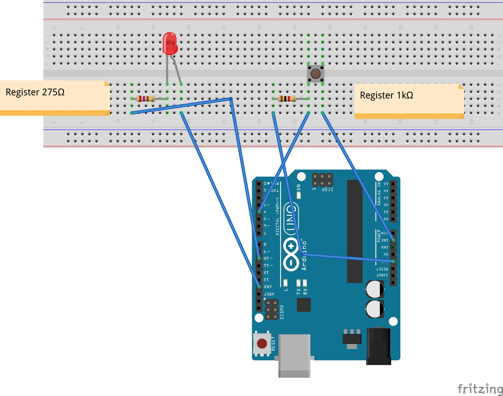

# Hello World

## 从HelloWorld开始

  我们写程序的时候都是从HelloWorld开始的,HelloWorld往往代表了最简单的程序是如何构建和编写的, 
那么我们这里也从HelloWorld开始.

## 准备工作

  * 一台Linux(WinServer不会玩)云主机,最好功能完整.(PS:很多免费的云主机完全不能用,最好不要去申请这个,推荐阿里云,基本配置足够)
  * 一台手机,苹果三星(iOS/Android)都可以.(PS:WP暂时不支持,不要问我为什么)
  * 一个树莓派+一个Arduino(PS:树莓派我用的是2代B型，其他应该也可以，但是在引脚上略有不同)
  * Linux相关知识,希望你最起码会基本使用

##　配置云主机
  首先你要先安装Python,阿里云主机自带Python2.7和Python3.4.3,你可以执行下面命令来验证:
>abcd@Linux:~/IOT_Practice$ python 
    Python 2.7.6 (default, Jun 22 2015, 17:58:13) 
    [GCC 4.8.2] on linux2 
    Type "help", "copyright", "credits" or "license" for more information. 
    \>>>

>abcd@Linux:~/IOT_Practice$ python3 
Python 3.4.3 (default, Oct 14 2015, 20:28:29) 
[GCC 4.8.4] on linux 
Type "help", "copyright", "credits" or "license" for more information. 
\>>>

  基本环境已经可以了,下面我们需要安装[pip](http://pypi.python.org/),一条命令即可:
>abcd@Linux:~/IOT_Practice$ sudo apt-get install pip

  pip用于依赖包的管理.Python官方建议我们不要在生产环境中直接安装各个依赖包和执行自己的程序,所以就有了 
虚拟环境[virtualenv](https://virtualenv.readthedocs.org/en/latest/),他可以做到:
  * 在没有权限的情况下安装新套件
  * 不同应用可以使用不同的套件版本
  * 套件升级不影响其他应用
  安装步骤也是一条命令:
> abcd@Linux:~/IOT_Practice$ sudo pip install virtualenv

  与以往不同的是,我们这里用到Python3的环境,所以需要指定Python的版本,于是用到下面的命令:
> abcd@Linux:~/IOT_Practice$ virtualenv -p /usr/bin/python3 venv3
Running virtualenv with interpreter /usr/bin/python3
Using base prefix '/usr'
New python executable in venv3/bin/python3
Also creating executable in venv3/bin/python
Installing setuptools, pip, wheel...done.

  这样我们就安装好了.下面我们需要做的就是激活这个虚拟环境,用到下面的命令:
> abcd@Linux:~/IOT_Practice$ source ./venv3/bin/activate
  (venv3)abcd@Linux:~/IOT_Practice$

  这样你就看到我们已经位于虚拟环境下了,我们终于可以开始工作了!我们下面进入服务器的安装,其实我们并没有对它进行定制, 
只是先从最简单的开始,这里我们使用的是[hbmqtt](https://github.com/beerfactory/hbmqtt),一条命令即可:
> (venv3)abcd@Linux:~/IOT_Practice$ pip install hbmqtt 
Collecting hbmqtt 
  Using cached hbmqtt-0.6-py34-none-any.whl 
Collecting docopt (from hbmqtt) 
Collecting pyyaml (from hbmqtt) 
Collecting websockets (from hbmqtt) 
  Using cached websockets-3.0-py33.py34.py35-none-any.whl 
Collecting passlib (from hbmqtt) 
  Using cached passlib-1.6.5-py2.py3-none-any.whl 
Collecting transitions==0.2.5 (from hbmqtt) 
Installing collected packages: docopt, pyyaml, websockets, passlib, transitions, hbmqtt
Successfully installed docopt-0.6.2 hbmqtt-0.6 passlib-1.6.5 pyyaml-3.11 transitions-0.2.5 websockets-3.0

  这样就安装好了,启动的话也很简单,直接执行hbmqtt即可,如下:
> (venv3)abcd@Linux:~/IOT_Practice$ hbmqtt

  到此,服务器端配置结束!

## Android客户端

  Android端相对来讲比较简单,使用[paho](http://www.eclipse.org/paho/#getting-started)的Android客户端,我已经同步到github上了,有apk 
直接下载,这个地方暂时不表!
  下载地址:http://pan.baidu.com/s/1mhqZcBu

## iOS客户端

## RaspberryPi + Arduino

### 先给树莓派刷个Linux系统
  这一段教程主要是针对Linux平台的.
  我们首先需要做的是给树莓派刷入一个系统,用官方的[Raspbian](https://www.raspberrypi.org/downloads/raspbian/)即可,基于debian.首先准备好你的读卡器和sd卡, 
我们先不要把内存卡插入电脑,先打开一个终端,运行下面的命令会出现相应的结果:
> ubuntu@Linux:~$ df -h 
udev            3.6G  4.0K  3.6G   1% /dev 
tmpfs           740M  1.3M  739M   1% /run 
/dev/sda3        53G   50G  868M  99% / 
none            4.0K     0  4.0K   0% /sys/fs/cgroup 

  然后插入内存卡,再次运行上面的命令:
> ubuntu@Linux:~$ df -h 
/dev/sdb1        15G  8.0K   15G   1% /media/ubuntu/sd
.....

  前后对比下,你就回发现哪个是SD卡的分区,正好巧了,SD卡对应的设备名称是/dev/sdb1,根据你系统配置的不同,设备名称可能有所不同, 
但是请先记下这个设备名称.
  这时,我们需要把SD卡从系统中卸载后才能开始磁盘镜像文件的烧录.输入下面的命令:
> ubuntu@Linux:~$ sudo umount /dev/sdb1

  需要管理员权限运行.如果无法正常卸载,请确认所有打开的终端中都没有把SD卡所挂载的目录作为当前工作目录. 
  那么这时我们需要知道SD卡的原始设备名称,把设备名称中的分区号去除了就得到原始设备名称了,那么原始设备名称就是
  > /dev/sdb

  将我们下载下来的镜像文件解压缩,存放在你的主目录中,然后使用dd命令将这个镜像文原样写入SD卡,命令如下:
> ubuntu@Linux:~$ sudo dd bs=1M if=~/2015-11-21-jessie-raspbian.img of=/dev/sdb

  下面我们就得等待了,烧录过程需要几分钟才能完成,而且烧录过程中不会输出任何进度信息,所以只能等待它执行完成了! 
执行完成后,为了保险起见,可以运行一下sudo synv命令,确保所有的数据都被正确的从系统缓存写回到SD卡上!
  这时弹出SD卡,并插入RaspberryPi中,它可以正常使用了!

### 然后让Arduino作为树莓派的接口板
  首先我们先为树莓派安装Arduino的IDE,命令如下:
  >  ubuntu@Linux:~$ sudo apt-get install arduino

  最好在执行上面命令之前先执行下update,命令如下:
  >  ubuntu@Linux:~$ sudo apt-get update

  那么这时候我们就不要再使用ssh登陆的方式打开了,IDE是个图形化的界面.可以使用远程的方式,也可以使用外接屏幕的方式来使用. 
  Arduino作为树莓派的接口板需要,在Arduino安装Frimata sketch,在树莓派上安装PyFirmata. 
  我们先来为Arduino安装Firmata,打开Arduino IDE,通过下面操作:
  > File->Example->Firmata->StandardFirmata

  这样就打开了StandardFirmata.这时我们将Arduino连接到树莓派上以便树莓派可以和Arduino进行通信并且为其提供电源. 
  然后我们需要把Firmata安装到Arduino上,点击先检查下是否有语法错误,然后点击 
  将程序安装到Arduino上,这时Arduino就开始等待与树莓派进行通信.

  最后我们需要在树莓派上安装PyFirmata,它要求使用PySerial库,这两个库都需要git,一并在此进行安装. 
  先在树莓派上安装git:
  > ubuntu@Linux:~$ sudo apt-get install git

  一条命令即可,后续安装需要用到git在github上下载这两个库的源代码,先操作PySerial:
  > ubuntu@Linux:~$ sudo apt-get install python-serial

  然后操作PyFirmata,先从github上下载源代码后安装:
  > ubuntu@Linux:~$ git clone https://github.com/tino/PyFirmata.git 
  ubuntu@Linux:~$ cd PyFirmata/ 
  ubuntu@Linux:~$ sudo python setup.py install

  到这里,软件的准备工作正式完成!

## 硬件准备
  有硬件才叫物联网啊!所以我将接入硬件!硬件中的'HelloWorld'就是先点亮一个LED.我们思考点亮LED的方式是一种被动接收的方式, 
  也就是说我们是发送一个指令"命令"LED点亮,这是一条路;我思考的是如果你需要去监测某些数据,比如室内的PM2.5数据,你如何去获取?
  比如按下了按键,我们也是以一种最简单的方式来表示这种情况. 
  那么这样我们就有两条路线要走了,一条是发送,另一条是接收,在MQTT协议中分别表示publish和subscribe. 
  还是去说硬件电路搭建的问题吧,我先上电路图了

  

  这里安利个开源的画电路图的软件,[Fritzing](http://fritzing.org/),Linux下这样的软件不好找啊,所以大家支持下! 
  按照图中所表示的连线来接入就可以了!

## 开始写代码了
  我们已经准备好了Android的代码,我只是做了把官方应用兼容Android Studio开发,暂时使用官方的应用程序,我会在后续单独写一个教程,介绍对android应用的定制化开发. 
  那么我们的服务器也已经搭建完毕了,我们只需要在服务器端运行hbmqtt命令即可,所以服务器端我们也不需要费心思了.同样的后续我也会有详细教程来介绍对服务器的定制开发. 
  这样我们就剩下树莓派端的代码编写了,在上代码之前还是请您大致看一下Python的语法,便于了解.包括我后续的面向树莓派的开发都是使用Python! 
  前面我们提到了两个思路,那么我们先去点亮一个LED,上代码在注释中解释相关代码的含义,如下: 
  >
    #!/usr/bin/env python
    # encoding: utf-8
    import pyfirmata
    import time
    import sys
    import paho.mqtt.client as mqtt # 第一步,导入我们需要的包
    board=pyfirmata.Arduino('/dev/ttyUSB0') # 初始化设备,这个地方设备名称上可能不同,有可能是/dev/ttyACM0
    led_pin = board.get_pin('d:10:o') # 初始化端口,d代表数字的,10代表10号端口,o代表输出的意思
    print("端口初始化!")
    def output_level(): # 控制LED的函数
    try:
        while True:
            led_pin.write(1)
            time.sleep(0.5)
            led_pin.write(0)
            time.sleep(0.5)
    except KeyboardInterrupt:
        pass
    # mqtt中的四个回调方法
    def on_connect(mqttc,obj,flag,rc):
        print("rc : "+str(rc))
    def on_message(mqttc,obj,msg):
        print(msg.topic+" "+str(msg.qos)+" "+str(msg.payload))
        #print("mid:"+str(mid))li
        output_level()
    def on_publish(mqttc,obj,mid):
        print("mid:"+str(mid))
        #print(msg.topic+" "+str(msg.qos)+" "+str(msg.payload))
    def on_subscribe(mqttc,obj,mid,granted_qos):
        print("Subscribed: "+str(mid)+" "+str(granted_qos))
    mqttc = mqtt.Client(protocol = mqtt.MQTTv311) # 初始化mqtt客户端,注意这里必须指定协议版本为3.1.1,否则无法与服务器通信
                                                # 会出现协议头不正确的错误,导致通信无法继续
    mqttc.on_message=on_message  # 回调方法的赋值
    mqttc.on_connect = on_connect
    mqttc.on_publish = on_publish
    mqttc.on_subscribe = on_subscribe
    mqttc.connect("114.215.93.235",1883,60) # 连接服务器
    mqttc.subscribe("abc",0) # 消息订阅,我们从手机上来控制
    mqttc.loop_forever() # 死循环,堵塞线程,运行

    下面是监听按键的代码:
    >
    #!/usr/bin/env python
    # encoding: utf-8
    import pyfirmata
    import time
    import paho.mqtt.client as mqtt
    import paho.mqtt.publish as publish
    board = pyfirmata.Arduino('/dev/ttyUSB0')
    switch_pin = board.get_pin('d:4:i')
    it = pyfirmata.util.Iterator(board) # 使用单独的迭代器线程来监听开关的状态读取
    it.start() # 开启线程
    switch_pin.enable_reporting() # 启用报告功能
    try:
        while True:
            input_state = switch_pin.read()
            print("input_state: %s" % input_state)
            if input_state == False: # 按键按下
                # 发送消息
                print('Button Pressed')
                publish.single("abc","1234567",hostname="114.215.93.235",protocol=mqtt.MQTTv311) # 发送广播消息到服务器
                print("============================")
                time.sleep(0.2)
    except KeyboardInterrupt:
        board.exit()

  代码不长也很简单,如果实在懒得敲的话,我也提供这个代码的下载,这里是[下载地址](https://github.com/JamesLiAndroid/IOT_Raspberry_Arduino)!

## 开始测试
  上述所有的步骤都完成
