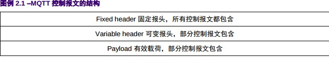
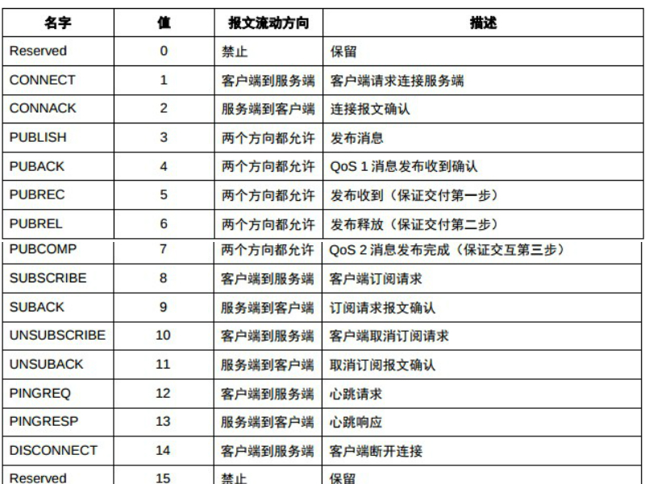

# 从MQTT协议说起

  MQTT协议,我们的所有通信建立在这个协议的基础之上,所以开篇先将这个协议认真梳理一下,结合源代码来分析一下. 
  **注意**:我们基于MQTT 3.1.1版本进行分析

## 简要介绍下MQTT
  MQTT 是一个客户端服务端架构的发布/订阅模式的消息传输协议。它的设计思想是轻巧、开放、
简单、规范，因此易于实现。这些特点使得它对很多场景来说都是很好的选择，包括受限的环境如
机器与机器的通信（M2M）以及物联网环境（IoT），这些场景要求很小的代码封装或者网络带宽
非常昂贵。
  本协议运行在 TCP/IP，或其它提供了有序、可靠、双向连接的网络连接上。它有以下特点：
  * 使用发布/订阅消息模式，提供了一对多的消息分发和应用之间的解耦。
  * 消息传输不需要知道负载内容。
  * 提供三种等级的服务质量：
    * “最多一次”，尽操作环境所能提供的最大努力分发消息。消息可能会丢失。例如，这个
      等级可用于环境传感器数据，单次的数据丢失没关系，因为不久之后会再次发送。
    * “至少一次”，保证消息可以到达，但是可能会重复。
    * “仅一次”，保证消息只到达一次。例如，这个等级可用在一个计费系统中，这里如果
      消息重复或丢失会导致不正确的收费。
  * 很小的传输消耗和协议数据交换，最大限度减少网络流量
  * 异常连接断开发生时，能通知到相关各方。

  选自:[http://blog.mcxiaoke.com/mqtt/protocol/MQTT-3.1.1-CN.pdf](http://blog.mcxiaoke.com/mqtt/protocol/MQTT-3.1.1-CN.pdf)
  摘要

## 协议简要分析
  今天重新回来看MQTT协议的时候,想要去跟着源代码完全分析一遍协议,发现这种方式麻烦,消耗成本很大,所以还是先分析下其中的工作流程,后续穿插着讲一下协议内容. 
  MQTT协议主要分为三个部分,如下图:
  

  主要的消息类型有:
  

  也就是我们用到的是14种消息类型,我们不要去强行记忆,我们下面通过分析工作流程来说明一下哪个位置用哪个消息. 
  下面我们先从我们在app上看得见摸得到的操作入手.
### 服务质量等级
  我们这里主要分析服务质量等级和协议流程,而且消息的主要操作是publish,也就是[MQTT文档](http://blog.mcxiaoke.com/mqtt/protocol/MQTT-3.1.1-CN.pdf)中的第四部分. 
  更直观一点说,在我们操作的应用程序界面中,有一个"QOS"单选框,选择0,1,2三种类型决定消息的服务质量等级. 
  服务质量等级分为三类,Qos分别等于0,1,2时,代表三类不同类型的传输方式!所以这三种方式各有特点:
  * Qos=0,表示最多分发一次,但是消息是否送达,这个依赖于底层网络能力!
    发送者Publish报文,其中Qos=0,DUP=0(DUP--控制报文的重复分发标志),发送到接收者处,接收者获取消息的所有权,对消息进行处理.
  * Qos=1,表示至少到达一次,可能会重复接收消息,但一定不会丢掉消息.
    发送者publish报文,Qos=1,DUP=0,发送到接收者处,接收者返回PUBACK的报文进行确认.
  * Qos=2,表示只有一次发送而且仅有一次接收,消息丢失,重复都不可以,最为精准的方式!
    操作过程类似TCP/IP协议的三次握手.发送者先publish消息到接收者,接受者对消息做一个处理,然后发送PUBREC报文向发送者确认,发送者再向接收者发送PUBREL报文确认消息收到. 
    过程比较复杂一些,但是这样保证了消息有且仅有到达一次!

###　主题名和主题过滤器
  主题名称就是你在topic一个编辑框中填写的内容,其内容代表了一个主题,无论是发布(publish)还是订阅(subscribe),都需要填写主题. 
  MQTT协议本身支持主题的过滤,通过过滤能够对不同的主题进行定制,对不同的主题做出反应!过滤器的规则如下:
  * 层级分隔符"/",将topic分层
  * 多层通配符"#",匹配"/"下面多个层级
  * 单层通配符"+",匹配"/"下面一个层级
  * 注意"$"的特殊性,"$SYS"不能应用在客户端,"$SYS"被广泛用作包含服务器特定信息或控制接口主题的前缀.
  * 使用UTF8编码
  比如,我们团队中有各个角色,例如manager,worker,programmer,others这四种角色,分别代表4种层级,每个层级有若干个人,然后我们来设定这样几种模式: 
  * 有一条消息,需要发布到manager下的所有人,于是topic为"manager/#"
  * 有一条消息,需要发布到programmer层级,topic就变成"manager/worker/+"
  上述五条是我们需要去注意和学习的,使用的过程中,我们再去穿插讲解如何去应用规则!

MQTT协议先介绍这么多,下面我们通过一个实际的项目来详细说明!
